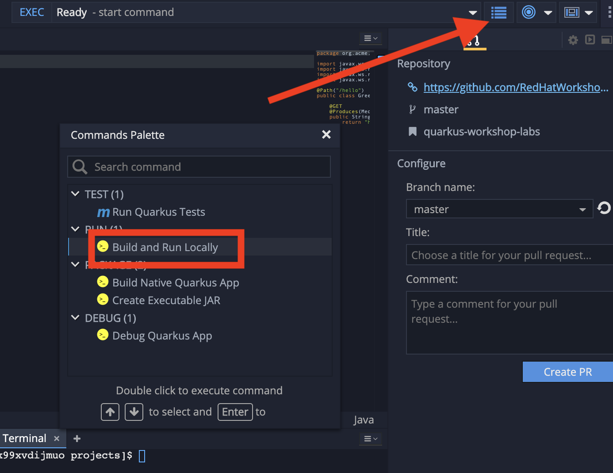
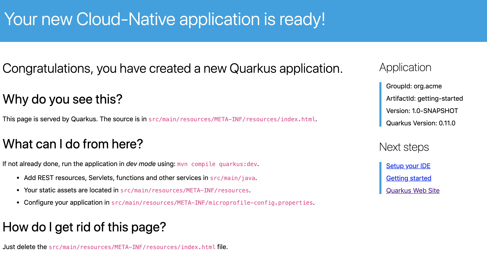

## The Basics

In this step, you will create a straightforward application serving a `hello` endpoint. To demonstrate dependency injection this endpoint uses a `greeting` bean. 

image::imgs/arch.png[]

## Import new project

In Che, click on **Import Project...**. In the dialog box, select **GITHUB** as the type of import, and then enter the following URL into the URL field and click **Import**.

[source,none,role="copypaste"]
----
https://github.com/jamesfalkner/summit-2019-devzone
----

image::imgs/import.png[]

After a few seconds, you'll get a _Project Configuration_ Dialog. Select **Maven** as the project type, and click **Save**.

image::imgs/importmaven.png[]

This will tell Che that the project is a Maven-based project, and be able to resolve dependencies and do error checking on the `pom.xml` file.

The structure of the project can be seen in the project browser to the left of the code editor:

image::imgs/structure.png[]

The project has

* The Maven structure
* An `org.acme.quickstart.GreetingResource` resource exposed on `/hello`
* A landing page that is accessible on `http://localhost:8080` after starting the application
* The application configuration file

Double-click on `pom.xml` in the project browser to open it in the editor. You will find the import of the Quarkus BOM, allowing to omit the version on the different Quarkus dependencies. In addition, you can see the `quarkus-maven-plugin` responsible of the packaging of the application and also providing the development mode.

[source,xml]
----
<dependencyManagement>
    <dependencies>
        <dependency>
            <groupId>io.quarkus</groupId>
            <artifactId>quarkus-bom</artifactId>
            <version>${quarkus.version}</version>
            <type>pom</type>
            <scope>import</scope>
        </dependency>
    </dependencies>
</dependencyManagement>
----

And a few more `<dependency>` imports and other ancillary sections. We will be adding things to our `pom.xml` in future sections.

Navigate to `src -> main -> java -> org.acme.quarkus.sample` in the project tree and double click on `GreetingResource.java`. This class has a very simple RESTful endpoint definition:

[source, java]
----
@Path("/hello")
public class GreetingResource {

    @GET
    @Produces(MediaType.TEXT_PLAIN)
    public String hello() {
        return "hello";
    }
}
----

It’s a very simple REST endpoint, returning "hello" to requests on `/hello`.

[NOTE]
====
Compared to vanilla JAX-RS, with Quarkus there is no need to create an `Application` class. It’s supported but not required. In addition, only one instance of the resource is created and not one per request. You can configure this using the different `*Scoped` annotations (`ApplicationScoped`, `RequestScoped`, etc).
====

## Running the Application

Now we are ready to run our application. In Che, select the _Command Palette_ by clicking on its icon in the upper right, and double-click on **Run Locally**:

This will compile and run the app using `mvn compile quarkus:dev` in a Terminal window. 

You should see:

[source,none]
----
2019-02-28 17:05:22,347 INFO  [io.qua.dep.QuarkusAugmentor] (main) Beginning quarkus augmentation
2019-02-28 17:05:22,635 INFO  [io.qua.dep.QuarkusAugmentor] (main) Quarkus augmentation completed in 288ms
2019-02-28 17:05:22,770 INFO  [io.quarkus] (main) Quarkus started in 0.668s. Listening on: http://localhost:8080
2019-02-28 17:05:22,771 INFO  [io.quarkus] (main) Installed features: [cdi, resteasy]
----

Note the amazingly fast startup time! The app is now running "locally" (within the Che container in which the workspace is also running). Che also makes the app accessible from outside the container by creating a Route (ingress) that is displayed at the top of the Terminal window. Look for _Preview URL_:

image::imgs/previewurl.png[]

Click on this link to open the link in a new tab, which will access the default Quarkus HTML page included in this app:

Since our RESTful endpoint listens on the `/hello` endpoint, add `/hello` to the end of the URL in your browser tab to access it.

You should see `hello` in your browser tab, which means its working!

Now, let's exercise the **live reload** capabilities of Quarkus. In Che, edit the `GreetingResource.java` file and change `return "hello";` to `return "hola";` in the editor. Press `CTRL-S` (or `CMD-S` on Mac OS) to save the file. Don't recompile or restart anything. Just try to reload the same brower tab that was showing `hello`. It should now show `hola`.

Wow, how cool is that? Supersonic Subatomic live reload! Go ahead and change it a few more times and access the endpoint again. And we're just getting started.

[NOTE]
====
`quarkus:dev` runs Quarkus in development mode. This enables live reload with background compilation, which means that when you modify your Java files your resource files and refresh your browser these changes will automatically take effect. 
====

[NOTE]
====
This will also listen for a debugger on port `5005`. If your want to wait for the debugger to attach before running you can pass `-Ddebug` on the command line. If you don’t want the debugger at all you can use `-Ddebug=false`. We'll use this later.
====

## Congratulations!

You've seen how to build a basic app, package it as an executable JAR and start it up very quickly. We'll leave the app running and rely on hot reload for the next steps.

In the next step we'll inject a custom bean to showcase Quarkus' CDI capabilities. 
